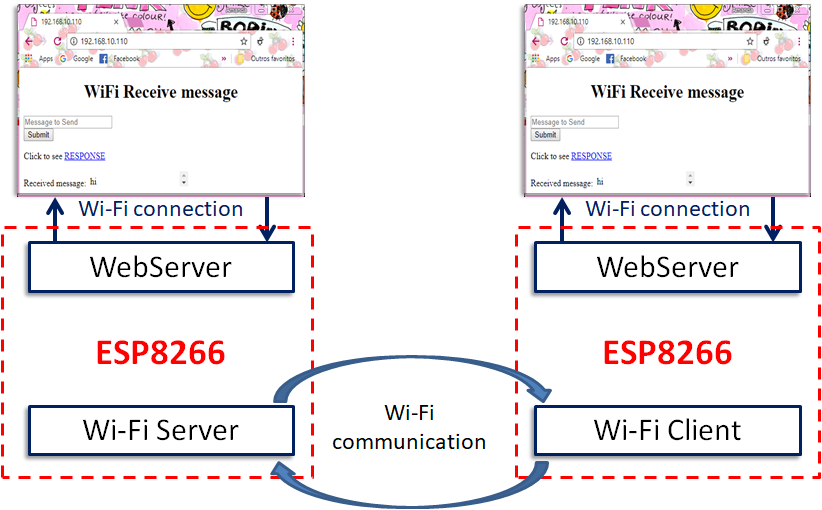
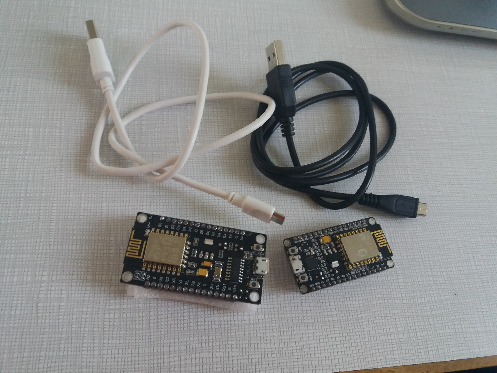

# Web-server-messenger-between-two-ESP8266-using-wifi-communication
This is a project to do a messaging web page where it is possible the communication between two Web servers through a WiFi communication using two ESP8266.The objective of this project is to learn how works the WiFi protocol at an ESP8266 and work at different types of WiFi communication.

## Contents
- [Introduction](#Introduction)
- [Tutorials](#Tutorials)
- [WiFi communication between two ESP8266](#WiFi-communication-between-two-ESP8266)
- [Web Server with ESP8266](#Web-Server-with-ESP8266)
- [Main Project](#Main-Project)
- [The code](#The-code)
- [Variables and Libraries](#Variables-and-Libraries)
- [Functions](#Functions)
- [Setup](#Setup)
- [Loop](#Loop)
- [Tests, problems and solutions](#Tests,-problems-and-solutions)
- [1st Simulation](#1st-Simulation)
- [2nd Simulation](#2nd-Simulation)
- [Solution](#Solution)
- [Conclusion](#Conclusion)

## Introduction
This is a project to do a messaging web page where it is possible the communication between two Web pages through two WiFi communications using two ESP8266.The objective of this project is to learn how works the WiFi protocol at an ESP8266 and work at different types of WiFi communication.

## Tutorials
### WiFi communication between two ESP8266
### Web Server with ESP8266
## Main Project
### The code
#### Variables and Libraries
#### Functions
#### Setup
#### Loop
### Tests, problems and solutions
#### 1st Simulation
#### 2nd Simulation
#### Solution
## Conclusion

