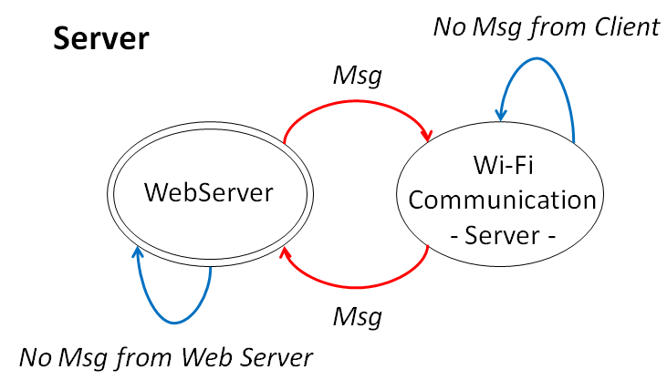

# Web-server-messenger-between-two-ESP8266-using-wifi-communication
This is a project to do a messaging web page where it is possible the communication between two Web servers through a WiFi communication using two ESP8266.The objective of this project is to learn how works the WiFi protocol at an ESP8266 and work at different types of WiFi communication.

## Contents
- [Introduction](#Introduction)
- [Tutorials](#Tutorials)
- [WiFi communication between two ESP8266](#WiFi-communication-between-two-ESP8266)
- [Web Server with ESP8266](#Web-Server-with-ESP8266)
- [Main Project](#Main-Project)
- [The code](#The-code)
- [Variables and Libraries](#Variables-and-Libraries)
- [Functions](#Functions)
- [Setup](#Setup)
- [Loop](#Loop)
- [Tests, problems and solutions](#Tests,-problems-and-solutions)
- [1st Simulation](#1st-Simulation)
- [2nd Simulation](#2nd-Simulation)
- [Solution](#Solution)
- [Conclusion](#Conclusion)

## Introduction
  This is a project to do a messaging web page where it is possible the communication between two Web pages through two WiFi communications using two ESP8266.The objective of this project is to learn how works the WiFi protocol at an ESP8266 and work at different types of WiFi communication.

Figure 1. Block schema from the project.

  The project messaging flow has to go from the the web page created by the Webserver of one ESP8266 to the other ESP8266 web page as seen at the figure 1. So it is necessary a WiFi communication between the both ESP8266 and a Webserver, to each ESP8266, to create a HTML that forms a web page and respond a request from the client. As we can see at the figure 2, where it shows the message flow (the arrows in red), the messages have to flow through Web pages and ESP8266s.
  To do it, this project was divided in two main sections, the WiFi communication between the two ESP8266 and the creation of two Web servers that communicate with the ESP8266s by WiFi.
  The materials used for this project are two ESP8266, two USB cables and two computers with Arduino Software IDE installed.
  
  

Figure 3. Material.

## Tutorials
  For the development of the project we use four different tutorials. One for the creation of the WiFi communication between the two ESP8266 and others two combining for the creation of the Web Servers.

### WiFi communication between two ESP8266
  For our main project the Wi-Fi communication between two ESP8266 is one of the two big parts, so we searched for a tutorial that explained how to create this communication. The tutorial chosen is called “UDP Android ESP” that can be found in the github link: https://github.com/gowgear/UDP-Android-ESP .
  The reason for the selection of this tutorial is that this gitHub project was made at the Service d'électronique et de Microélectronique of UMONS, meaning that we could have contact with the owner of this project. Also, it was selected because it is very similar to what we will use in this project and the coding was very simple and clear to understand.
  The first time we runned the program it did not work. The two ESP8266 did not connect to each other. Because we didn’t know what was the problem, we asked the creator of the project of the tutorial for help. He said that the problem was on the setup of the client.
  Since the original project uses an Android client it wasn’t clear that the ESP8266 client has different setup then the server in the programming with the IDE and must be settled different. So, from this point on, we had two codes, one for the server and one for the client. And the server sent fixed message through the channel were the client would listen and show at its serial plot.
  Once we did this, the next step was to make the message, that was sent until now with a fixed char data type (char  ReplyBuffer[] = "Hardware & Software Labs"), to be written in the serial plot, simulating the client writing something from an external window. To do it so, it was used the serial plot.
  The last step was sending the message in both directions in real time, since the tutorial only sent messages in both ways only during the setup and this part wasn’t working. In conclusion, adapting the tutorial we created a communication ping pong.
With the intention of sharing our changes to others, which may be useful to someone else, we've created a GitHub for this part only. Here is the link: “https://github.com/MandyBB/Wifi-Communication-with-two-ESP8266”. On this GitHub there is the codes and a demo video.

### Web Server with ESP8266
  The other part of the project was the creation of a webserver with the ESP8266 to process incoming network requests of a client over an HTML from a Web page. Creating the interface of the messenger where the user can work on.
  For the creation of this part it has been used three tutorials. With the first tutorial, called “ESP8266 Web Server with HTML Web Page”, that can be fount at the link https://circuits4you.com/2016/12/16/esp8266-web-server-html/, we learned how to create with an ESP8266 a web server with HTML web page. In this tutorial,  the ESP8266 connects to a WiFi Network that provides internet and sends a simple text to the web page.
  At this same tutorial, it was possible to find some examples and other tutorials related to the content. One of them was used too to this project. The tutorial “ESP8266 Arduino WiFi Web Server LED on off control”, that can be checked at the link https://circuits4you.com/2018/02/05/esp8266-arduino-wifi-web-server-led-on-off-control/, was used to create the answer part of the project. This tutorial taught us how to implement a button to check some message in a window without refreshing the page.
  The last tutorial, called “ESP8266 First Web Server” from the link https://tttapa.github.io/ESP8266/Chap10%20-%20Simple%20Web%20Server.html, we learned how to use the web server to serve interactive pages, and to use POST and GET request. This was the base to create the part for our user writing and sending a message.
  All of this tutorial were tested and worked perfectly, so the next step was using this three as models for the WebServer that would be used at the main project. We started with the third tutorial to create the Web Server and to send the message. With that, it was possible to store the message created by the User. The second thing we did was using the second tutorial to show a message without reloading the page by pressing a button. And to finish, we unite both parts to create a Web page where a user sends a message pressing the button to send and sees this message on the button to see answers. 
The main changes done for this project can be seen at the list below:
- Created the variable MAIN_page where is stored our HTML page in an array of characters. Here we changed the format of the web page from the second tutorial. We added a Text Box where you can write the word desired for sending, one button (submit called “Login”) for sending the word, one button to see the message received and one frame where the word sending is printed. The last two vinculated to a target (“myIframe”).
- After that, was the time to change the receiving and sending aspects of the tutorial. For this part, not much was changed, but we connected the variables of the message that was sended with the message that was received. This part was more about understanding how the GET and POST functions of the WebServer worked, how to handle with them and also how the iframe worked. In the tutorial, the ESP8266 hosts a web page with a button. When the button is pressed, the browser sends a POST request to /LED. For our case. We have used the POST for catch the writing value in the TextBox and in the handleInComeMSG (associated to the webpage by "/login") we convert the string to a char, due to the fact that in the serial port we only can transmit char values. (See it better in the code).
  With the intention of sharing our changes and being useful for other people we also have created another GitHub only for this part. The link is below. On the GitHub there is also a video of the demonstration.

https://github.com/josehp22/Webserver-with-ESP8266

  Once we have these two big parts created, we can put them together and create our project.

## Main Project
  The main project, like said at the introduction, is a messenger between 2 ESP8266 based on a wifi communication and a web server software. So, once we have the two parts done, we have to join them together.
  Since both parts works with the Wi-Fi system from their ESP8266 and the ESP8266 works only with one channel per time, it is important to turn on/off the Wi-Fi channel every single time it is used. To do it so, we elaborated a sequence of events that the both ESP8266 should follow.

  So, as it is possible to see at the figure 7, there has 2 ESP8266 with different codes, but both must have all the functions as initializations for clients and server, which was showed to have a lot of problem in the union of the codes. So, it was created another resolution for the unique Wi-Fi channel which is shown at figure 8. In this resolution, the Server ESP8266 is always the Wi-Fi communication server and the Client ESP8266 will always be the Wi-Fi communication client.
  
  
  
Figure 8. Msg is the message to be transmitted.

  Also, both ESP8266 must start in different settings, the Server must Start at the WebServer and the Client at the Wi-Fi communication. This inicial state is needed because if both are in the Wi-Fi communication setup there won’t be possible to change the message to send information toward the communication, and if both are in WebServer they will pass information to each other just when both have something to say, and that is not what we want.
  So, with this new schematics we worked on a pseudo program code to work in the loop of each ESP8266, to change the Wi-Fi communication type, that can be seen below at the figure 9. Note that this pseudocode is just to illustrate the changes of the Wi-Fi sets, meaning that it doesn’t have the reading and sending function of both parts (WebServer and Wi-Fi communication).

  

  Notice that in this situation it doesn’t appear the switch off of the Wi-Fi set. It happens because it was decided to do the switch off of the Wi-Fi setup used every time we called a new one. Finally, the codes could be united and tested together.

### The code
  For the code, as said before, it has to be done two codes, one for the client and one for the server even though most parts of the codes are the same. Also, for this part, we will separate this section between Variables, functions, setup and loop.

#### Variables and Libraries
  The variables and the libraries for the main code are the same for Server and Client. It is important to include all the libraries for Wifi connection for ESP8266 (<ESP8266WiFi.h>, <WiFiUdp.h>, <WiFiClient.h>, <ESP8266WebServer.h>) and also to build the HTML page.
  Another important thing that must be done is to declare the variables to the WebServer configuration which are the SSID, password, the port number and a class and the variables for the Wi-Fi communication which are the IP address (local, dns, netmask and remote).

#### Functions
The functions created for this project are on the list below.
- **setupWIFI**: Where is done the the setup for the Wifi communication between the two ESP8266. This configuration must be different for both client and station and at the beginning of this setup must also have two disconnection functions for possible previous Wifi connection;
- **SendingMensage**: this function was created to send the message through the Wi-Fi connection between both ESP8266;
- **ReceivingMensage**: it was designed for receiving and converting the message from the Wi-Fi communication between both ESP8266;
- **handleRoot**: responsible for the creation of the HTML page;
- **handleLMsg**: it is used when the user at the WebServer asks to see the answer if it has;
- **handleInComeMSG**: this is for handling the message that the user wrote at the WebServer for sending;
- **setupWebServer**: the initial configuration for the WebServer. It must also content the disconnection functions for a possible previous Wifi connection.

#### Setup
  The setup for both ESP8266 is just for beginning the serial port. The serial port is used to show the id of the WebServer and also shows the message that is coming and where the program is in the moment. 

#### Loop
  The loop, as showed at the beginning of this section is a bit different from Server and Client. The difference is where both starts. Even though that, both loops have the same three cases on the switch function that changes according to the variable var that changes during the process. So the cases are:
- **case 1:** Setup of WebServer and waits for the message to come from it;
- **case 2:** Setup of Wi-Fi communication and sending the message through it;
- **case 3:** Receive the message from the Wi-Fi communication.

### Tests, problems and solutions
  The first test of the project finished did not work. Because of that we decided to test both ESP8266 separated since the only link between the two ESP8266 is the Wi-Fi communication we decided to use the second ESP8266 with just the Wi-Fi communication code that we knew it was working.

#### 1st Simulation
  The first one to be tested was the Server ESP8266. When started the program, the Server ESP8266 did not show any problem. Like said before, it is supposed to start with the HTML page and when the user writes something on the window followed by a click on the bottom “Submit”, it turns off the WebServer and starts the Wi-Fi communication with the other ESP8266, sending a message and waiting for the answer. This part was perfect, like we can see at the images below, the Server ESP8266 follows all this steps and also, after that, it restarts the WebServer web page and it is possible to see the message sent by the other ESP8266.
  The problem appears right after this first complete loop. When the user tries to write the answer back, the system turns off the WebServer and turns on the Wi-Fi communication but the other ESP8266 does not receive the message. More strange than that, the Server ESP8266 thinks it sent and wait for the response through the channel, which is possible. If we wrote something on the Client ESP8266 it appears at the Server ESP8266 and it continues its loop like nothing had happened.
  Since we couldn’t find an explanation for that, we thought that the problem maybe could be easier to see on the Client ESP8266, so we decided to check the Client ESP8266 code and simulate it.

#### 2nd Simulation
  The Client ESP8266 has to start with the Wi-Fi communication and wait for the answer. By then, everything was fine. It waited for the message to come and then, when it received, it was supposed to send to the WebServer. So, the sequence of the events is: Turn off Wi-Fi communication; Turn on WebServer; Show information of the Web Server Ip address at the serial port; copy this address at the internet browser to see the HTML; Write message or see the answer at the HTML.
  But when it was on the “Show information of the Web Server Ip address at the serial port” event, the IP address showed was 11.11.11.11 which is the IP address of the Wi-Fi communication, and if we put this IP address at the internet browser, nothing happened. With that, we concluded that maybe the problem was at the wifi disconnection part or in the setup part.
  To make sure that the problem was not in the setup area, we decided to do another simulation, where the Client started with the WebServer setup, not the Wi-Fi communication. But making the Client start with the WebServer setup wasn’t a good idea and, even though it setted the IP address right at the beginning, it stopped working the Wi-Fi communication.

#### Solution
  After all of this simulation, we realized that the problem  is at the disconnection of the previous Wi-Fi IP address. In our code, every single time we call a new Wi-Fi setup (for the communication between both ESP and the communication with the WebServer) we use two functions: WiFi.softAPdisconnect(true) that disconnect stations from the network established by the soft-AP. It is set to true, so it will switch the soft-AP mode off; and the WiFi.disconnect(true) that disconnects the WiFi shield from the current network.
  With that, we thought that everything was fine, but, searching on the internet, we discovered that this two arguments does not work if called before the connection, which sounded strange, so we searched more, and apparently there is no solution yep for this issue. Here are some forums talking about the matter:
- https://github.com/espressif/arduino-esp32/issues/400
- https://forum.arduino.cc/index.php?topic=431854.0 
  Another possible problem is the fact that we are using two types of IP address, one Statical that is created to do the Wi-Fi communication between the two ESP8266 and the other is a non Statical used for the connection to the WLAN where has an internet access where the WebServer is based off.
  Unfortunately, there wasn’t found any solution for this problem and the search toward an answer failed since in the internet this subject apparently is new or inexistent. So this problem may be a good subject of post-project research.

## Conclusion
  One of the main objectives of this project was to work with the ESP8266 module and get to know it a little better. We decided that we wanted to focus on one of its particularities, which is the WiFi connection. For this we chose to do the WiFi communication between two ESP8266. 
  One of the suggestions of the professor to our project was to expand it and create two web servers and that the communication was produced through these as in a messenger. After evaluating this option we decided to take it.
  During the two lab sessions to create our project, we managed to move forward with it, but as we have already mentioned some problems were found. These two sessions were not enough and we had to work more time in the project to find a final solution. During this time we have achieved what was one of our objectives, investigate and get to learn more about ESP8266. We have also learned to develop a project from scratch, first collecting information from different tutorials and then applying it and creating a new idea.
  Team work has been fundamental for this project, as well as the help given by the professor and the assistants. Finally after all the work we can say that we are happy with what we have learned and achieved thanks to the realization of this project.
